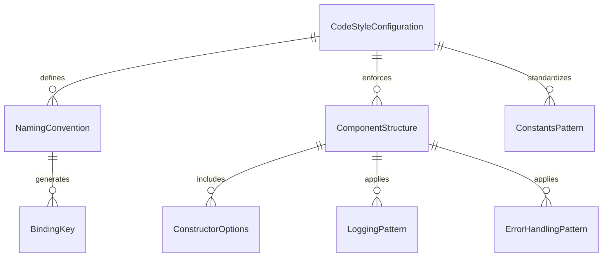
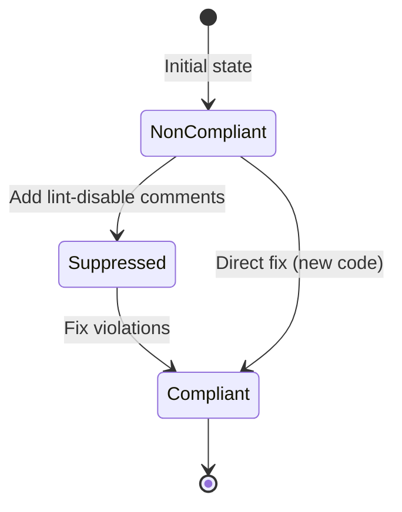

# Data Model: Code Style Standards Compliance

**Feature**: 001-code-style-standards
**Date**: 2025-12-25
**Status**: COMPLETE

## Overview

This document describes the "data model" for code style standards - which includes the configuration entities, naming conventions, and structural patterns that define the Ignis coding standards.

---

## Core Entities

### 1. CodeStyleConfiguration

Represents the set of formatting and linting rules applied to the codebase.

| Property         | Type     | Description                  | Required |
| ---------------- | -------- | ---------------------------- | -------- |
| `prettierConfig` | `object` | Prettier formatting settings | Yes      |
| `eslintConfig`   | `object` | ESLint code quality rules    | Yes      |
| `tsconfig`       | `object` | TypeScript compiler options  | Yes      |

**Validation Rules**:

- All configs must extend from `@venizia/dev-configs`
- Prettier and ESLint must not have conflicting rules
- TypeScript must enable `experimentalDecorators` and `emitDecoratorMetadata`

**Default Values**:

```typescript
const DEFAULT_CODE_STYLE_CONFIG = {
  prettier: {
    bracketSpacing: true,
    singleQuote: false,
    printWidth: 100,
    trailingComma: "all",
    arrowParens: "avoid",
    semi: true,
  },
  eslint: {
    extends: ["@venizia/dev-configs/eslint"],
  },
  typescript: {
    extends: "@venizia/dev-configs/tsconfig.common.json",
  },
};
```

---

### 2. NamingConvention

Defines standardized naming patterns for various code elements.

| Property           | Type     | Description                   | Example        |
| ------------------ | -------- | ----------------------------- | -------------- |
| `interfacePrefix`  | `string` | Prefix for interface names    | `"I"`          |
| `typeAliasPrefix`  | `string` | Prefix for type alias names   | `"T"`          |
| `componentSuffix`  | `string` | Suffix for component classes  | `"Component"`  |
| `controllerSuffix` | `string` | Suffix for controller classes | `"Controller"` |
| `serviceSuffix`    | `string` | Suffix for service classes    | `"Service"`    |
| `repositorySuffix` | `string` | Suffix for repository classes | `"Repository"` |
| `adapterSuffix`    | `string` | Suffix for adapter classes    | `"Adapter"`    |
| `fileCase`         | `string` | Case style for file names     | `"kebab-case"` |

**Validation Rules**:

```typescript
// Interface validation
function isValidInterfaceName(name: string): boolean {
  return name.startsWith("I") && /^[A-Z]/.test(name[1]);
}

// Type alias validation
function isValidTypeAliasName(name: string): boolean {
  return name.startsWith("T") && /^[A-Z]/.test(name[1]);
}

// Class name validation
function isValidClassName(name: string, suffix: string): boolean {
  return name.endsWith(suffix) && /^[A-Z]/.test(name[0]);
}
```

**Examples**:

```typescript
// Interfaces
(IUserService, IFileSystemAdapter, IValidationHelper);

// Type Aliases
(TUserRequest, TFileSystemConfig, TEvent);

// Classes
(FileSystemComponent, S3Adapter, UserService);
```

---

### 3. ConstantsPattern

Represents the static class pattern for defining constants (replaces enums).

| Property    | Type                     | Description                      | Required |
| ----------- | ------------------------ | -------------------------------- | -------- |
| `className` | `string`                 | Name of the constants class      | Yes      |
| `values`    | `Record<string, string>` | Constant name to value mapping   | Yes      |
| `schemeSet` | `Set<string>`            | Internal set for O(1) validation | Yes      |
| `isValid`   | `function`               | Runtime validation method        | Yes      |

**Validation Rules**:

- All values must be strings or numbers
- `isValid()` method must return type predicate
- `SCHEME_SET` must be private readonly

**Type Extraction**:

```typescript
import { TConstValue } from "@venizia/ignis-helpers";

class HttpMethod {
  private static readonly _SCHEME_SET = new Set<string>(["GET", "POST", "PUT", "DELETE"]);

  static readonly GET = "GET";
  static readonly POST = "POST";
  static readonly PUT = "PUT";
  static readonly DELETE = "DELETE";

  static isValid(value: string): value is THttpMethod {
    return this._SCHEME_SET.has(value);
  }
}

type THttpMethod = TConstValue<typeof HttpMethod>;
// Type is: 'GET' | 'POST' | 'PUT' | 'DELETE'
```

---

### 4. ComponentStructure

Defines the standard directory structure for feature components.

| Property        | Type       | Description                            | Required |
| --------------- | ---------- | -------------------------------------- | -------- |
| `featureName`   | `string`   | Name of the feature (kebab-case)       | Yes      |
| `hasController` | `boolean`  | Whether component has a controller     | No       |
| `hasCommon`     | `boolean`  | Whether component has common directory | No       |
| `files`         | `string[]` | List of files in component             | Yes      |

**File Structure**:

```text
src/components/[feature-name]/
├── index.ts                    # Barrel export (REQUIRED)
├── [feature-name].component.ts # Component class (REQUIRED)
├── [feature-name].controller.ts# Controller (OPTIONAL)
└── common/                     # Shared types/constants (OPTIONAL)
    ├── index.ts
    ├── types.ts
    └── constants.ts
```

**Validation Rules**:

- Every directory must have an `index.ts`
- Component file must match directory name
- Files use kebab-case with type suffix

---

### 5. LoggingPattern

Defines the format for log messages throughout the codebase.

| Property           | Type       | Description                    | Example                     |
| ------------------ | ---------- | ------------------------------ | --------------------------- |
| `prefixFormat`     | `string`   | `[ClassName][methodName]`      | `"[UserService][getUser]"`  |
| `messageFormat`    | `string`   | Description + optional context | `"Fetching user \| ID: %s"` |
| `formatSpecifiers` | `string[]` | Printf-style specifiers        | `["%s", "%d", "%j"]`        |

**Format Specification**:

```typescript
// Pattern
[ClassName][methodName] Message | Key: %s

// Examples
logger.info('[UserService][getUser] Fetching user | ID: %s', userId);
logger.debug('[S3Adapter][upload] Upload complete | Size: %d bytes', size);
logger.error('[FileSystem][delete] File not found | Path: %s', filePath);
```

**Validation Rules**:

- Class name must be actual class name (not abbreviated)
- Method name must be actual method name
- Context key-value pairs use `|` separator
- Format specifiers: `%s` (string), `%d` (number), `%j` (JSON)

---

### 6. ErrorHandlingPattern

Defines the format for error messages thrown throughout the codebase.

| Property       | Type               | Description               | Required |
| -------------- | ------------------ | ------------------------- | -------- |
| `prefixFormat` | `string`           | `[ClassName][methodName]` | Yes      |
| `message`      | `string`           | Descriptive error message | Yes      |
| `statusCode`   | `HTTP.ResultCodes` | HTTP status code          | Yes      |
| `helper`       | `string`           | `getError` function name  | Yes      |

**Format Specification**:

```typescript
import { getError } from "@venizia/ignis";
import { HTTP } from "@venizia/ignis";

// Pattern
throw getError("[ClassName][methodName] Descriptive message", HTTP.ResultCodes.STATUS);

// Examples
throw getError("[UserService][getUser] Invalid user ID", HTTP.ResultCodes.BAD_REQUEST);
throw getError("[S3Adapter][upload] Upload failed", HTTP.ResultCodes.INTERNAL_SERVER_ERROR);
throw getError("[FileSystem][read] File not found", HTTP.ResultCodes.NOT_FOUND);
```

**Validation Rules**:

- Must use `getError` helper from `@venizia/ignis`
- Must include class and method context
- Must provide appropriate HTTP status code
- Message must be descriptive (not just "Error")

---

### 7. BindingKey

Defines the format for dependency injection binding keys.

| Property | Type     | Description               | Pattern                      |
| -------- | -------- | ------------------------- | ---------------------------- |
| `key`    | `string` | Unique binding identifier | `@app/[component]/[feature]` |

**Pattern**:

```typescript
const BINDINGS = {
  // Format: @app/{component}/{feature}
  FILE_SYSTEM_COMPONENT: "@app/filesystem/component",
  FILE_SYSTEM_ADAPTER: "@app/filesystem/adapter",
  S3_ADAPTER: "@app/s3/adapter",
  USER_SERVICE: "@app/user/service",
  USER_REPOSITORY: "@app/user/repository",
};
```

**Validation Rules**:

- Must start with `@app/`
- Three levels: component, feature, type
- Use kebab-case
- All lowercase

---

### 8. ConstructorOptions

Represents the options pattern for configurable classes.

| Property          | Type       | Description                | Required |
| ----------------- | ---------- | -------------------------- | -------- |
| `DEFAULT_OPTIONS` | `object`   | Default values as const    | Yes      |
| `requiredKeys`    | `string[]` | Keys that must be provided | Yes      |
| `optionalKeys`    | `string[]` | Keys with defaults         | No       |

**Pattern**:

```typescript
interface IS3AdapterOptions {
  bucketName: string; // Required
  region?: string; // Optional (has default)
  maxRetries?: number; // Optional (has default)
  accessKey?: string; // Optional
}

class S3Adapter {
  static readonly DEFAULT_OPTIONS = {
    region: "us-east-1",
    maxRetries: 3,
  } as const;

  constructor(private readonly options: IS3AdapterOptions) {
    // Validate required options
    if (!options.bucketName) {
      throw getError(
        "[S3Adapter][constructor] bucketName is required",
        HTTP.ResultCodes.BAD_REQUEST,
      );
    }
    // Merge with defaults
    this.options = { ...S3Adapter.DEFAULT_OPTIONS, ...options };
  }
}
```

**Validation Rules**:

- `DEFAULT_OPTIONS` must be defined as `static readonly`
- Required keys must be validated in constructor
- Use `getError` for validation failures
- Include context in error messages

---

## Relationships



---

## State Transitions

This feature does not involve runtime state - it's a compile-time/lint-time standard. However, the **migration state** of the codebase follows this progression:



**Migration States**:

| State          | Description                                     | Action Required        |
| -------------- | ----------------------------------------------- | ---------------------- |
| `NonCompliant` | File has violations, not suppressed             | Add suppression or fix |
| `Suppressed`   | File has violations, suppressed for gradual fix | Track for remediation  |
| `Compliant`    | File passes all linting/formatting checks       | None                   |

---

## Validation Summary

| Entity                 | Validation Method                | Tools                                  |
| ---------------------- | -------------------------------- | -------------------------------------- |
| CodeStyleConfiguration | ESLint/Prettier dry-run          | `eslint --dry-run`, `prettier --check` |
| NamingConvention       | ESLint rules                     | `@typescript-eslint/naming-convention` |
| ConstantsPattern       | Manual review + custom lint rule | ESLint plugin                          |
| ComponentStructure     | Directory lint script            | Custom script                          |
| LoggingPattern         | ESLint rule (custom)             | Regex match                            |
| ErrorHandlingPattern   | ESLint rule (custom)             | Regex match                            |
| BindingKey             | ESLint rule (custom)             | Regex match                            |
| ConstructorOptions     | TypeScript strict mode           | `strictNullChecks`                     |

---

## References

- [Ignis Code Style Standards](https://github.com/VENIZIA-AI/ignis/blob/d58f0093/packages/docs/wiki/get-started/best-practices/code-style-standards.md)
- [research.md](./research.md) - Technical decisions and rationale
