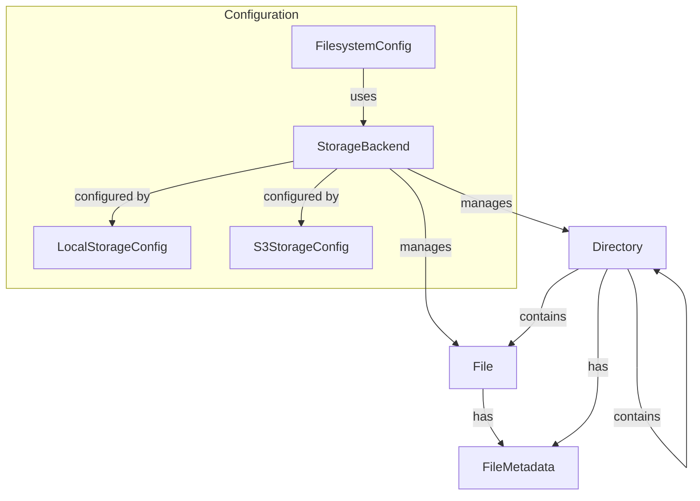

# Data Model: Filesystem Component

**Date**: 2025-12-23  
**Feature**: Filesystem Component (001-filesystem-component)  
**Based on**: [spec.md](spec.md) and [research.md](research.md)

## Core Entities

### 1. File

Represents a unit of data storage with content, path, and metadata.

**Attributes**:

- `path`: string (required) - Absolute or relative path to the file
- `content`: Buffer | string (optional) - File content (for in-memory operations)
- `size`: number (bytes) - File size in bytes
- `encoding`: string - Character encoding (utf8, base64, hex, etc.)
- `metadata`: FileMetadata - Associated metadata (timestamps, permissions)

**Validation Rules**:

- Path must be non-empty string
- Path must not contain illegal characters (OS-dependent)
- Size must be non-negative integer
- Encoding must be supported by Node.js Buffer

**State Transitions**:

- `created` → `modified` → `deleted`
- Files can be moved (`path` change) without changing identity

### 2. Directory

Represents a container for organizing files and subdirectories.

**Attributes**:

- `path`: string (required) - Absolute or relative path to the directory
- `entries`: Array<File | Directory> - Contents of the directory
- `isEmpty`: boolean - Whether directory contains any entries
- `metadata`: FileMetadata - Directory metadata

**Validation Rules**:

- Path must be non-empty string
- Path must end with directory separator on some platforms
- Cannot contain files with duplicate names

**Relationships**:

- Contains zero or more `File` entities
- Contains zero or more `Directory` entities (subdirectories)
- Belongs to a parent `Directory` (except root)

### 3. StorageBackend

Represents the underlying storage implementation.

**Attributes**:

- `type`: 'local' | 's3' | 'memory' - Type of storage backend
- `config`: StorageConfig - Backend-specific configuration
- `isAvailable`: boolean - Whether backend is currently accessible
- `capabilities`: Array<string> - Supported features (e.g., 'streaming', 'metadata', 'permissions')

**Configuration Variants**:

**LocalStorageConfig**:

- `basePath`: string - Root directory for file operations
- `createMissingDirs`: boolean - Whether to create missing directories automatically

**S3StorageConfig**:

- `bucket`: string (required) - S3 bucket name
- `region`: string (required) - AWS region
- `accessKeyId`: string - AWS access key (optional, uses AWS credentials chain)
- `secretAccessKey`: string - AWS secret key (optional, uses AWS credentials chain)
- `endpoint`: string - Custom endpoint for S3-compatible services
- `forcePathStyle`: boolean - Use path-style addressing
- `prefix`: string - Key prefix for all operations (virtual directory)

**Validation Rules**:

- Type must be one of supported backend types
- Required configuration fields must be present for selected type
- S3 bucket name must follow AWS naming rules

### 4. FileMetadata

Represents information about a file without its content.

**Attributes**:

- `size`: number (bytes) - File size
- `createdAt`: Date - Creation timestamp
- `modifiedAt`: Date - Last modification timestamp
- `accessedAt`: Date - Last access timestamp
- `permissions`: FilePermissions - File access permissions
- `isFile`: boolean - Whether entry is a file (vs directory)
- `isDirectory`: boolean - Whether entry is a directory
- `isSymbolicLink`: boolean - Whether entry is a symbolic link (local only)

**FilePermissions**:

- `ownerRead`: boolean
- `ownerWrite`: boolean
- `ownerExecute`: boolean
- `groupRead`: boolean
- `groupWrite`: boolean
- `groupExecute`: boolean
- `othersRead`: boolean
- `othersWrite`: boolean
- `othersExecute`: boolean

**Validation Rules**:

- Timestamps must be valid Date objects or null
- Size must be non-negative integer
- `isFile` and `isDirectory` are mutually exclusive for non-symbolic links

## Relationships

## State Management

### File Lifecycle

1. **Non-existent**: File does not exist in storage
2. **Creating**: Write operation in progress
3. **Exists**: File is persisted and readable
4. **Modifying**: Write/append operation in progress
5. **Deleting**: Unlink operation in progress
6. **Deleted**: File no longer exists (may be in trash/recycle depending on backend)

### Directory Lifecycle

1. **Non-existent**: Directory does not exist
2. **Creating**: Mkdir operation in progress
3. **Exists**: Directory is available
4. **Populating**: Files being added/removed
5. **Deleting**: Rmdir operation in progress
6. **Deleted**: Directory no longer exists

## Constraints and Business Rules

### Cross-Backend Consistency

1. File operations must behave identically regardless of backend (within backend limitations)
2. Metadata availability may vary by backend (S3 has limited permission model)
3. Symbolic links only supported on local filesystem

### Path Handling

1. Path normalization applied before operations
2. Relative paths resolved relative to backend's base path
3. Absolute paths may be restricted based on backend configuration

### Error Conditions

1. File not found → `FileNotFoundError`
2. Permission denied → `PermissionError`
3. Storage full/quota exceeded → `StorageError`
4. Network timeout (S3) → `NetworkError`
5. Invalid path → `ValidationError`

## Data Persistence

### Local Filesystem

- Files stored as regular OS files
- Metadata from filesystem (inode, timestamps, permissions)
- Direct mapping to physical storage

### AWS S3

- Files stored as S3 objects
- Metadata from S3 object metadata and headers
- Additional metadata in object tags or DynamoDB (if enhanced metadata needed)

### Memory (Future)

- Files stored in memory (for testing)
- Volatile, not persisted
- Simulated metadata

## Migration Considerations

1. **Local to S3 Migration**: Requires copying files with metadata preservation
2. **S3 to Local Migration**: Similar process, permissions may be approximated
3. **Backend Switching**: Applications should handle temporary unavailability during switch
