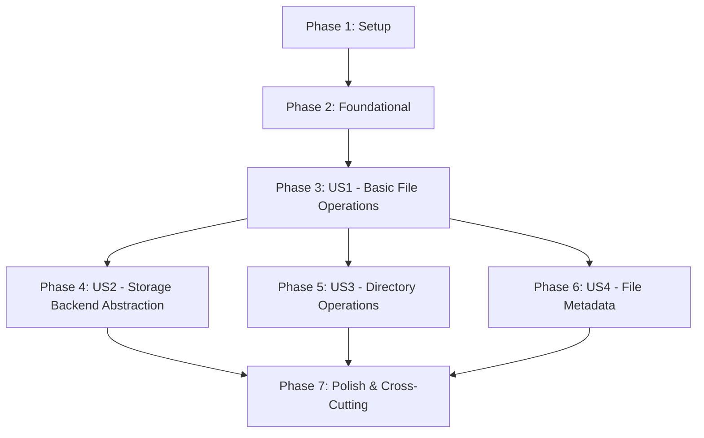

# Implementation Tasks: Filesystem Component

**Feature**: 001-filesystem-component  
**Date**: 2025-12-23  
**Based on**: [spec.md](spec.md), [plan.md](plan.md), [data-model.md](data-model.md), [contracts/](contracts/), [research.md](research.md), [quickstart.md](quickstart.md)

## Summary

Create a transparent filesystem abstraction library that provides a consistent interface for file operations across multiple storage backends (local filesystem and AWS S3). The library will maintain Node.js fs module compatibility while allowing developers to switch between storage backends through configuration only.

## Dependencies & Story Completion Order



**Parallel Execution Opportunities**:

- US2, US3, and US4 can be developed in parallel after US1 completion
- Within each story: Model, Service, and Adapter tasks can be parallelized where marked [P]

## Phase 1: Setup (Project Initialization)

- [x] T001 Verify project structure matches implementation plan
- [x] T002 [P] Install required dependencies: `npm install @aws-sdk/client-s3 @venizia/ignis`
- [x] T003 [P] Configure TypeScript compiler options in `tsconfig.json`
- [x] T004 [P] Configure Jest for TypeScript testing in `jest.config.js`
- [x] T005 Create directory structure: `src/{adapters,core,utils,interfaces,types}/`

## Phase 2: Foundational (Blocking Prerequisites)

- [x] T006 Define error hierarchy in `src/errors/filesystem-errors.ts`
- [x] T007 [P] Create configuration types in `src/types/config.ts`
- [x] T008 [P] Create utility functions in `src/utils/path-utils.ts`
- [x] T009 [P] Create base adapter interface in `src/interfaces/adapter.interface.ts`
- [x] T010 Create factory function skeleton in `src/core/filesystem-factory.ts`

## Phase 3: User Story 1 - Basic File Operations (Priority: P1)

**Story Goal**: Developers need to perform basic file operations (read, write, delete) using a consistent interface regardless of storage backend.

**Independent Test Criteria**: Can be fully tested by creating, reading, updating, and deleting files using the filesystem interface without requiring any other functionality.

### Implementation Tasks

- [x] T011 [P] [US1] Create LocalAdapter class skeleton in `src/adapters/local-adapter.ts`
- [x] T012 [P] [US1] Create S3Adapter class skeleton in `src/adapters/s3-adapter.ts`
- [x] T013 [US1] Implement `readFile` method in LocalAdapter
- [x] T014 [US1] Implement `writeFile` method in LocalAdapter
- [x] T015 [US1] Implement `unlink` method in LocalAdapter
- [x] T016 [US1] Implement `readFile` method in S3Adapter
- [x] T017 [US1] Implement `writeFile` method in S3Adapter
- [x] T018 [US1] Implement `unlink` method in S3Adapter
- [x] T019 [US1] Update factory to instantiate adapters in `src/core/filesystem-factory.ts`
- [x] T020 [US1] Create integration tests for basic file operations in `tests/integration/basic-operations.test.ts`

## Phase 4: User Story 2 - Storage Backend Abstraction (Priority: P2)

**Story Goal**: Developers need to switch between local filesystem and cloud storage (S3) without changing application code.

**Independent Test Criteria**: Can be fully tested by configuring the component with different storage backends and verifying that the same file operations work identically.

### Implementation Tasks

- [x] T021 [P] [US2] Enhance configuration interface in `src/types/config.ts`
- [x] T022 [P] [US2] Create configuration validation in `src/utils/config-validator.ts`
- [x] T023 [US2] Implement configuration-based adapter selection in factory
- [x] T024 [US2] Add environment variable support for S3 credentials
- [x] T025 [US2] Create contract tests for interface compliance in `tests/contract/filesystem-contract.test.ts`
- [x] T026 [US2] Implement error mapping between backends in `src/utils/error-mapper.ts`
- [x] T027 [US2] Create example configuration files in `examples/`
- [x] T028 [US2] Add backend-specific configuration documentation

## Phase 5: User Story 3 - Directory Operations (Priority: P3)

**Story Goal**: Developers need to manage directories (create, list, remove) to organize files hierarchically.

**Independent Test Criteria**: Can be fully tested by creating directories, listing their contents, and removing them without requiring other file operations.

### Implementation Tasks

- [x] T029 [P] [US3] Implement `mkdir` method in LocalAdapter
- [x] T030 [P] [US3] Implement `readdir` method in LocalAdapter
- [x] T031 [P] [US3] Implement `rmdir` method in LocalAdapter
- [x] T032 [US3] Implement `mkdir` method in S3Adapter (using prefix-based simulation)
- [x] T033 [US3] Implement `readdir` method in S3Adapter (list objects with prefix)
- [x] T034 [US3] Implement `rmdir` method in S3Adapter (delete objects with prefix)
- [x] T035 [US3] Add recursive directory support for both adapters
- [x] T036 [US3] Create directory operation tests in `tests/integration/directory-operations.test.ts`

## Phase 6: User Story 4 - File Metadata and Statistics (Priority: P4)

**Story Goal**: Developers need to access file metadata (size, modification time, permissions) for monitoring and decision-making.

**Independent Test Criteria**: Can be fully tested by creating files and retrieving their metadata without performing content-based operations.

### Implementation Tasks

- [x] T037 [P] [US4] Implement `stat` method in LocalAdapter
- [x] T038 [P] [US4] Implement `lstat` method in LocalAdapter
- [x] T039 [P] [US4] Implement `access` method in LocalAdapter
- [x] T040 [US4] Implement `stat` method in S3Adapter (using S3 headObject)
- [x] T041 [US4] Implement `lstat` method in S3Adapter (same as stat, no symlinks)
- [x] T042 [US4] Implement `access` method in S3Adapter
- [x] T043 [US4] Implement `exists` utility method in both adapters
- [x] T044 [US4] Create FileStats implementation for S3 metadata
- [x] T045 [US4] Create metadata tests in `tests/integration/metadata-operations.test.ts`

## Phase 7: Polish & Cross-Cutting Concerns

- [x] T046 [P] Implement `copyFile` method in both adapters
- [x] T047 [P] Implement `rename` method in both adapters
- [x] T048 [P] Implement `appendFile` method in both adapters
- [x] T049 [P] Implement `realpath` method in both adapters
- [x] T050 Implement stream operations: `createReadStream` and `createWriteStream`
- [x] T051 Add large file support (>1GB) with streaming
- [x] T052 Implement comprehensive error handling for edge cases
- [ ] T053 Add performance benchmarks in `benchmarks/`
- [x] T054 Create main library export in `src/index.ts`
- [x] T055 Update package.json with proper scripts and metadata
- [x] T056 Generate API documentation using TypeDoc
- [x] T057 Create comprehensive README.md
- [x] T058 Add CI/CD pipeline configuration
- [ ] T059 Run full test suite: `npm test && npm run lint`
- [ ] T060 Build and verify distribution: `npm run build`

## Parallel Execution Examples

### Example 1: Parallel Development of Adapters

```
Developer A: T011, T013-T015 (LocalAdapter file operations)
Developer B: T012, T016-T018 (S3Adapter file operations)
Developer C: T006-T010 (Foundational components)
```

### Example 2: Parallel Story Implementation (after US1)

```
Developer A: T021-T028 (US2 - Storage abstraction)
Developer B: T029-T036 (US3 - Directory operations)
Developer C: T037-T045 (US4 - Metadata operations)
```

### Example 3: Cross-Cutting Polish Tasks

```
Developer A: T046-T049 (Additional file operations)
Developer B: T050-T052 (Streaming and error handling)
Developer C: T053-T057 (Documentation and tooling)
```

## Implementation Strategy

### MVP Scope (Minimum Viable Product)

The MVP includes only **User Story 1 (Basic File Operations)** which provides:

- Core file operations (read, write, delete) for both local and S3 storage
- Working factory function to create filesystem instances
- Basic error handling
- This delivers immediate value as a usable filesystem abstraction

### Incremental Delivery Plan

1. **Week 1**: Setup + US1 (Basic operations) → Deployable MVP
2. **Week 2**: US2 (Storage abstraction) + US3 (Directory operations) → Enhanced functionality
3. **Week 3**: US4 (Metadata) + Polish tasks → Production-ready library
4. **Week 4**: Documentation, testing, performance optimization → Release candidate

### Testing Strategy

- **Unit tests**: Each adapter method independently
- **Integration tests**: Full operation flows with actual storage backends
- **Contract tests**: Verify interface compliance across all adapters
- **Performance tests**: Ensure <2x overhead vs native operations

## Task Validation

**Total Tasks**: 60  
**Tasks per Story**:

- Setup: 5 tasks
- Foundational: 5 tasks
- US1: 10 tasks
- US2: 8 tasks
- US3: 8 tasks
- US4: 9 tasks
- Polish: 15 tasks

**Parallel Opportunities**: 18 tasks marked [P] (30% of total)

**Independent Test Criteria**: Each user story has clearly defined test criteria that can be verified independently.

**File Path Completeness**: All tasks include specific file paths for implementation.

**Checklist Format Compliance**: All tasks follow required `- [ ] TXXX [P] [USX] Description` format.
